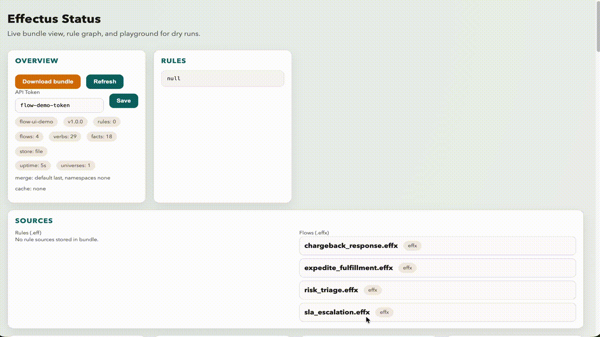

# Effectus - Typed, Deterministic Rule Engine


Effectus is a strongly-typed rule engine that turns live Facts into safe, deterministic Effects. It enforces types at compile time, supports dynamic extensions, and runs as a library or a daemon with hot-reloadable bundles.

## Highlights

- Typed facts and verbs with proto/JSON schema support
- Deterministic evaluation and static validation before runtime
- Dynamic extensions (JSON + OCI bundles) and static Go extensions
- Runtime daemon with UI, dry-run playground, ACLs, and rate limits
- Multi-source facts (Kafka, CDC, SQL, S3, Iceberg, AMQP, gRPC, Redis, files)

## Quick start

### 1) Install

```bash
go install github.com/effectus/effectus-go/cmd/effectusc@latest
go install github.com/effectus/effectus-go/cmd/effectusd@latest
```

### 2) Define facts (JSON schema or proto)

```json
// schemas/fraud_facts.json
[
  {"path": "transaction.id", "type": {"primitive": "string"}},
  {"path": "transaction.amount", "type": {"primitive": "float"}},
  {"path": "customer.tier", "type": {"primitive": "string"}}
]
```

### 3) Write rules

```eff
rule "HighRiskLargeTxn" {
  when { transaction.amount > 1000 }
  then { FlagFraud(orderId: transaction.id) }
}
```

### 4) Bundle + run

```bash
effectusc bundle \
  --name fraud-demo \
  --version 1.0.0 \
  --schema-dir schemas \
  --verb-dir verbs \
  --rules-dir rules \
  --output bundle.json

effectusd --bundle bundle.json --http-addr :8080
# open http://localhost:8080/ui
```

For non-library deployments (YAML config, ConfigMaps, mixed HTTP/OCI verbs), see `docs/RUNTIME_CONFIG.md`.

## Standalone runtime (primary mode)

Run `effectusd` with a YAML/JSON config to operate as a standalone service:

```yaml
# effectusd.yaml
bundle:
  oci: "ghcr.io/myorg/bundles/fraud-demo:1.0.0"
  reload_interval: "60s"

http:
  addr: ":8080"
metrics:
  addr: ":9090"

api:
  auth: "token"
  token: "${EFFECTUS_WRITE_TOKEN}"
  read_token: "${EFFECTUS_READ_TOKEN}"
  hotload_rules: true

facts:
  store: "file"
  path: "/var/lib/effectus/facts.json"
  merge_default: "last"
  cache:
    policy: "lru"
    max_universes: 200
    max_namespaces: 50

verbs:
  duplicate_policy: "error"
  oci_warmup: true
  strict: true

extensions:
  dirs: ["./extensions"]
  oci:
    - "ghcr.io/myorg/extension-bundles/payments:1.2.0"
```

Run it:

```bash
effectusd --config effectusd.yaml
```

Bundle/compiler example (creates a distributable bundle):

```bash
effectusc bundle \
  --name fraud-demo \
  --version 1.0.0 \
  --schema-dir examples/fraud_e2e/schema \
  --verb-dir examples/fraud_e2e/verbs \
  --rules-dir examples/fraud_e2e/rules \
  --output out/fraud-demo.bundle.json
```

For more config patterns (mixed verb sources, schema providers, Kubernetes ConfigMaps), see `docs/RUNTIME_CONFIG.md`.

## Extensions (verbs)

Effectus supports multiple extension styles:

- Static: Go executors via `loader.NewStaticVerbLoader(...)`
- Dynamic: JSON verb manifests (`*.verbs.json`)
- OCI bundles: publish and hot-reload bundles from GHCR

Dynamic verb example (HTTP target):

```json
{
  "name": "ExternalAPI",
  "version": "1.0.0",
  "verbs": [
    {
      "name": "ValidateAccount",
      "argTypes": {"accountId": "string"},
      "requiredArgs": ["accountId"],
      "returnType": "ValidationResult",
      "target": {"type": "http", "config": {"url": "https://api.example.com/validate"}}
    }
  ]
}
```

See `docs/EXTENSION_SYSTEM.md` for full manifest schema and OCI publishing.

### Go-backed verbs (OCI-distributed executors)

If you want verbs implemented in Go (in-process), use plugins and distribute them via OCI as an artifact, then mount the
plugin directory into `effectusd`:

```bash
# Build plugin (.so) with Go executors
go build -buildmode=plugin -o plugins/payments.so ./examples/verbs/payments

# Publish the plugin directory as an OCI artifact
oras push ghcr.io/myorg/effectus-plugins:1.0.0 ./plugins
```

Run `effectusd` with the plugin directory mounted (e.g., via Helm/ConfigMap/init container) and enable plugin loading:

```yaml
verbs:
  plugin_dirs:
    - "/plugins"
```

For cross-container Go executors, publish JSON verb manifests to OCI and target your Go service via `http` or `grpc`.

## Runtime UI + API

`effectusd` ships a lightweight status UI with rules, flows, schema summaries, a dependency graph, and a dry-run playground.
`/api/*` endpoints are token-protected by default; `/ui`, `/healthz`, and `/readyz` are open.
Enable `/api/rules/validate` + `/api/rules/hotload` (and the in-UI rule editor) with `--rules-hotload` or `api.hotload_rules`.

```bash
effectusd --bundle bundle.json --api-token devtoken
curl -X POST http://localhost:8080/api/facts \
  -H 'Authorization: Bearer devtoken' \
  -H 'Content-Type: application/json' \
  -d '{"universe":"prod","facts":{"customer":{"tier":"gold"}}}'
```

## Library usage (embed in Go)

Use the library when you want in-process execution or custom wiring:

```go
ts := types.NewTypeSystem()
ts.RegisterFactType("order.id", types.NewStringType())
ts.RegisterFactType("order.total", types.NewFloatType())

registry := verb.NewRegistry(ts)
_ = registry.RegisterVerb(&verb.Spec{
  Name:       "FlagHighValue",
  ArgTypes:   map[string]string{"orderId": "string"},
  ReturnType: "bool",
  Executor:   myExecutor,
})

facts := common.NewBasicFacts(map[string]interface{}{
  "order": map[string]interface{}{"id": "o-1", "total": 2500.0},
}, ts)

comp := compiler.NewCompiler()
compTS := comp.GetTypeSystem()
compTS.RegisterFactType("order.id", types.NewStringType())
compTS.RegisterFactType("order.total", types.NewFloatType())
compTS.RegisterVerbType("FlagHighValue", map[string]*types.Type{"orderId": types.NewStringType()}, types.NewBoolType())

parsed, _ := comp.ParseAndTypeCheck("rules/flags.eff", facts)
specAny, _ := (&list.Compiler{}).CompileParsedFile(parsed, "rules/flags.eff", facts.Schema())
spec := specAny.(*list.Spec)
spec.VerbRegistry = registry
_ = spec.Execute(context.Background(), facts, nil)
```

See `docs/TUTORIALS.md` for a compact library walkthrough and extension loaders.

## UI demos

Run the demo bundles + UI locally:

```bash
just ui-demo
just ui-flow-demo
```

## Screenshots & video




## Key docs

- `docs/README.md` - documentation index
- `docs/TUTORIALS.md` - short tutorials
- `docs/COMMANDS.md` - CLI reference
- `docs/RUNTIME_CONFIG.md` - non-library runtime config (YAML)
- `docs/PRODUCTION_RUNBOOK.md` - production checklist, hotload, rollback
- `docs/FACT_SOURCES.md` - streaming and batch adapter tutorials
- `docs/EXTENSION_SYSTEM.md` - verbs and bundles
- `docs/SYSTEM_INTENT.md` / `docs/GLOSSARY.md` - model and vocabulary

## Production & Helm

- Helm chart: `charts/effectusd/` (OCI-ready runtime chart)
- Runtime config (non-library mode): `docs/RUNTIME_CONFIG.md`
- Production runbook: `docs/PRODUCTION_RUNBOOK.md`

## Development

```bash
just build
just test
just lint
```

See `CONTRIBUTING.md` for workflow details.

## License

MIT - see `LICENSE`.
