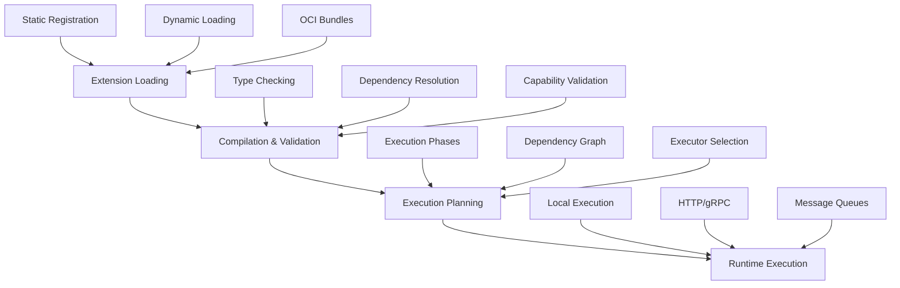

# Effectus Architecture

This document provides a high-level architectural overview of Effectus, focusing on the coherent flow from extension loading through compilation to execution.

## Architectural Philosophy

Effectus implements a **coherent flow architecture** that ensures:
- **Static validation** catches all errors before runtime
- **Clear separation** between specifications and implementations
- **Flexible execution** supports multiple deployment patterns
- **Mathematical rigor** provides formal correctness guarantees

## Core Flow



## System Layers

### 1. Extension Layer
**Purpose**: Load verbs and schemas from multiple sources

**Components**:
- `ExtensionManager`: Coordinates all extension loading
- `StaticLoader`: Compile-time registration
- `JSONLoader`: Runtime configuration files
- `ProtoLoader`: Protocol Buffer definitions
- `OCILoader`: Distributed bundle packages

**Key Interfaces**:
```go
type Loader interface {
    Name() string
    Load(target LoadTarget) error
}

type VerbSpec interface {
    GetName() string
    GetCapabilities() []string
    GetArgTypes() map[string]string
}
```

### 2. Compilation Layer
**Purpose**: Validate and optimize extensions before execution

**Components**:
- `ExtensionCompiler`: Orchestrates compilation process
- `TypeSystem`: Manages type definitions and validation
- `DependencyValidator`: Checks verb dependencies
- `CapabilityValidator`: Verifies security constraints
- `ExecutionPlanOptimizer`: Creates optimized execution strategies

**Key Outputs**:
```go
type CompiledUnit struct {
    VerbSpecs     map[string]*CompiledVerbSpec
    Functions     map[string]*CompiledFunction
    TypeSystem    *TypeSystem
    ExecutionPlan *ExecutionPlan
    Dependencies  []string
    Capabilities  []string
}
```

### 3. Execution Layer  
**Purpose**: Execute compiled verbs with appropriate executors

**Components**:
- `ExecutionRuntime`: Manages complete execution lifecycle
- `ExecutorFactory`: Creates appropriate executors for verbs
- `LocalExecutor`: In-process execution
- `HTTPExecutor`: Remote HTTP API calls
- `MessageExecutor`: Queue-based execution

**Key Features**:
- State management with hot-reload
- Argument validation and type checking
- Error handling and compensation
- Parallel and sequential execution phases

## Mathematical Foundations

### Category Theory Basis
- **Functors**: Map between type categories
- **Natural Transformations**: Preserve structural relationships
- **Monads**: Compose effectful computations
- **Initial Algebras**: Define recursive data structures

### Type System
```go
type TypeSignature struct {
    InputTypes  map[string]string
    OutputType  string
    Constraints []TypeConstraint
}
```

### Capability System
```go
const (
    CapRead   Capability = 1 << iota
    CapWrite
    CapCreate  
    CapDelete
)
```

Capabilities form a lattice: `Read ≤ Write ≤ Create ≤ Delete`

## Execution Models

### Local Execution
- **Direct**: Verb implemented as Go function
- **Plugin**: Loaded from shared library
- **WASM**: WebAssembly module execution

### Remote Execution
- **HTTP**: RESTful API calls with retry policies
- **gRPC**: Typed remote procedure calls
- **Message**: Async execution via queues (Kafka, RabbitMQ)

### Hybrid Execution
- **Fallback**: Try local, fall back to remote
- **Load Balancing**: Distribute across multiple endpoints
- **Circuit Breaker**: Fail fast on repeated errors

## Data Flow

```
Facts (Input) → Rule Evaluation → Effects (Output)
     ↓               ↓                ↓
  Typed Data    Boolean Logic    Typed Actions
  (Protocol     (Predicates)     (Verb Calls)
   Buffers)
```

### Fact System
- **Schema Registry**: Manages type definitions
- **Path Resolution**: Navigate complex data structures  
- **Version Compatibility**: Handle schema evolution
- **Validation**: Ensure data integrity

### Effect System
- **Capability Protection**: Security and resource control
- **Idempotency**: Safe retry and recovery
- **Compensation**: Saga-style transaction rollback
- **Ordering**: Dependency-aware execution

## Deployment Patterns

### Embedded Library
```go
import "github.com/effectus/effectus-go/runtime"

runtime := runtime.NewExecutionRuntime()
// Use directly in Go applications
```

### Standalone Service
```bash
effectusd --oci-ref ghcr.io/myorg/rules:v1.0.0
# HTTP/gRPC service for any language
```

### Sidecar Pattern
```yaml
# Kubernetes deployment
containers:
- name: app
  image: myapp:latest
- name: effectus
  image: effectusd:latest
```

## Integration Points

### Data Sources
- **HTTP APIs**: REST endpoints for fact ingestion
- **Message Queues**: Kafka, RabbitMQ for event streams
- **Databases**: Direct queries for fact extraction
- **File Systems**: Batch processing from files

### Effect Sinks
- **APIs**: Call external services
- **Databases**: Update records and state
- **Message Queues**: Publish events and notifications
- **File Systems**: Generate reports and logs

## Security Model

### Capability-Based Access
- **Principle of Least Privilege**: Verbs request minimal capabilities
- **Static Verification**: Capabilities checked at compile time
- **Resource Isolation**: Prevent unauthorized access
- **Audit Trail**: Track all capability usage

### Deployment Security
- **OCI Signatures**: Verify bundle authenticity
- **RBAC Integration**: Kubernetes/cloud role bindings
- **Network Policies**: Restrict communication
- **Secret Management**: Secure credential handling

## Observability

### Metrics
- **Execution Counts**: Rules fired, verbs executed
- **Performance**: Latency, throughput, resource usage
- **Errors**: Failure rates, error types
- **Capacity**: Queue depth, resource utilization

### Tracing
- **Distributed Tracing**: OpenTelemetry integration
- **Execution Flow**: Track rule and verb execution
- **Dependencies**: Visualize inter-verb relationships
- **Performance**: Identify bottlenecks

### Logging
- **Structured Logs**: JSON format for machine processing
- **Correlation IDs**: Track requests across services
- **PII Redaction**: Automatic sensitive data masking
- **Audit Logs**: Security and compliance tracking

## Scalability

### Horizontal Scaling
- **Stateless Design**: Multiple runtime instances
- **Load Balancing**: Distribute fact processing
- **Shared State**: External stores for coordination
- **Auto-scaling**: Based on queue depth and latency

### Performance Optimization
- **Parallel Execution**: Concurrent verb execution
- **Dependency Optimization**: Minimize sequential dependencies
- **Caching**: Cache compiled units and results
- **Batching**: Process multiple facts together

## Future Directions

### Advanced Features
- **Multi-tenant Isolation**: Namespace separation
- **A/B Testing**: Gradual rule deployment
- **Machine Learning**: Predictive rule optimization
- **Formal Verification**: Mathematical correctness proofs

### Language Support
- **Rust Implementation**: High-performance runtime
- **Python Bindings**: Data science integration
- **JavaScript/WASM**: Browser and edge deployment
- **SQL Integration**: Database-native execution

This architecture provides a solid foundation for building reliable, scalable, and maintainable rule-based systems while maintaining mathematical rigor and practical usability. 