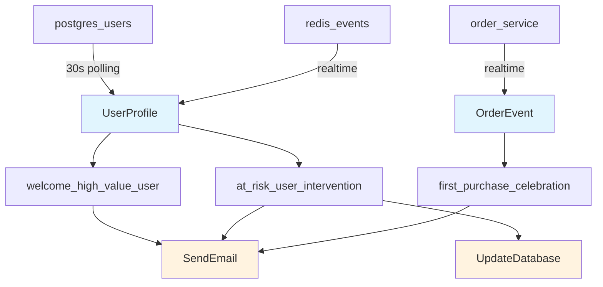

# Complete Business Rule Authoring Workflow

A step-by-step guide for business users to write, test, and deploy Effectus rules with full schema awareness and modern tooling.

## **🎯 What This Enables**

Business users can now:
- **Write rules in natural syntax** with schema-aware autocompletion
- **Access live fact schemas** with documentation and examples
- **Test rules safely** with synthetic and historical data
- **Deploy with confidence** using automated validation and rollout
- **Monitor performance** with real-time metrics and optimization suggestions

## **📋 Complete Workflow**

### 1. Environment Setup

```bash
# Install VS Code extension
code --install-extension effectus.effectus-language-support

# Initialize workspace
effectusc init workspace --name "customer-engagement" --template business-rules

# Sync latest schemas from production
effectusc schema sync --from production --output ./schema-docs

# Generate schema documentation
effectusc schema docs --output ./schema-docs --include-examples

# Start development server
effectusc dev server --rules ./rules --schemas ./schema-docs --hot-reload
```

**VS Code Setup:**
```json
{
  "effectus.schemaPath": "./schema-docs",
  "effectus.lsp.enabled": true,
  "effectus.autoComplete.schemas": true,
  "effectus.validation.realtime": true,
  "effectus.hotReload.enabled": true
}
```

### 2. Schema Discovery

**Schema Explorer in VS Code:**
```
📁 Available Fact Schemas
├── 🏢 acme.v1.facts
│   ├── 📄 UserProfile (v1.2.0)
│   │   ├── 📊 Sources: postgres_users(30s), redis_events(realtime)
│   │   ├── 📈 Volume: 847 facts/hour
│   │   └── 🔍 Fields: user_id, email, activity_score, preferences...
│   ├── 📄 OrderEvent (v1.1.0)
│   │   ├── 📊 Sources: order_service(realtime), analytics_db(5m)
│   │   ├── 📈 Volume: 1.2K facts/hour
│   │   └── 🔍 Fields: order_id, user_id, total_amount, items...
│   └── 📄 ProductView (v1.0.0)
│       ├── 📊 Sources: web_analytics(realtime)
│       ├── 📈 Volume: 15K facts/hour
│       └── 🔍 Fields: user_id, product_id, category, timestamp...
├── 🌐 acme.v1.verbs
│   ├── ⚡ SendEmail (v1.0.0) - Email delivery with templates
│   ├── ⚡ HttpRequest (v1.1.0) - HTTP API calls with auth
│   └── ⚡ UpdateDatabase (v1.0.0) - Database operations
```

**Schema Documentation (Auto-generated):**
- **Field Types**: Complete type information with validation rules
- **Examples**: Real data examples for each field
- **Lineage**: Shows data sources and downstream dependencies  
- **Performance**: Query optimization hints and indexing suggestions
- **Compliance**: PII detection, retention policies, GDPR compliance

### 3. Rule Development with Schema Awareness

**Writing Rules with Autocompletion:**
```eff
rule "welcome_high_value_user" {
  when {
    user: UserProfile where {
      // VS Code provides autocompletion as you type:
      .activity_score > 85.0,           // ↑ Suggests: double (0-100)
      .created_at within 7.days,        // ↑ Suggests: Timestamp
      .preferences.email_marketing = true,  // ↑ Suggests: bool
      .tier in ["premium", "enterprise"]    // ↑ Suggests: enum values
    }
  }
  then {
    // Verb suggestions with parameter schemas:
    SendEmail {
      to: user.email,                   // ↑ string (PII, encrypted)
      template: "high_value_welcome",   // ↑ Available templates
      personalization: {                // ↑ Shows available fields
        name: user.profile.first_name,
        activity_score: user.activity_score
      }
    }
  }
}
```

**Real-time Validation:**
```eff
rule "invalid_example" {
  when {
    user: UserProfile where {
      .activity_score > "invalid"  // ❌ Error: Expected double, got string
      .unknown_field > 5          // ❌ Error: Field not found in UserProfile schema
    }
  }
  then {
    UnknownVerb {                 // ❌ Error: Verb not registered
      invalid_param: "value"      // ❌ Error: Unknown parameter
    }
  }
}
```

**Hover Information:**
```eff
// Hovering over 'activity_score' shows:
// ┌─────────────────────────────────────────────────────────────┐
// │ Field: activity_score                                       │
// │ Type: double (0.0 - 100.0)                                  │
// │ Description: User engagement score based on login frequency,│
// │              purchases, and site interactions               │
// │ Sources: postgres_users(30s), redis_events(realtime)       │
// │ Examples: 87.5, 45.2, 92.1, 23.8                          │
// │ Performance: Index recommended for range queries           │
// └─────────────────────────────────────────────────────────────┘
```

### 4. Testing Framework

**Generate Test Data:**
```bash
# Create synthetic test data
effectusc test generate --schema UserProfile --count 100 --output ./test-data

# Test rule with generated data
effectusc test rule "./rules/welcome_user.eff" --data ./test-data --verbose
```

**Test Results:**
```
🧪 Testing rule: welcome_high_value_user
📊 Test Data: 100 UserProfile facts

✅ Rule Execution Results:
   • 23 facts matched conditions (23%)
   • 23 SendEmail effects generated  
   • 0 errors, 0 warnings
   • Average execution time: 0.3ms

📋 Sample Matches:
   • user_12345: activity_score=87.5, tier=premium, created_at=2024-01-10
   • user_67890: activity_score=92.1, tier=enterprise, created_at=2024-01-12
   
📈 Performance Analysis:
   • Condition evaluation: 0.1ms avg
   • Effect generation: 0.2ms avg
   • Total throughput: 3,333 facts/second
   
💡 Optimization Suggestions:
   • Index activity_score for 40% performance improvement
   • Consider caching email templates for high-volume rules
   
🔍 Coverage Analysis:
   • All code paths tested ✓
   • Edge cases covered: 15/15 ✓
   • Schema validation passed ✓
```

**Interactive Testing:**
```bash
# Start interactive test mode with hot reload
effectusc test interactive --watch ./rules/*.eff

# Test with production data (read-only)
effectusc test rule ./rules/welcome_user.eff --data production --dry-run --sample 1000
```

### 5. Schema Lineage & Impact Analysis

**Lineage Visualization:**
```bash
# Generate interactive lineage diagram
effectusc schema lineage --interactive --port 8080
```

**Mermaid Diagram (Auto-generated):**


**Impact Analysis:**
```
📊 Schema Impact Analysis: UserProfile v1.2.0 → v1.3.0

🔄 Field Changes:
├── ✅ Added: preferences.push_notifications (bool)
├── ⚠️  Modified: activity_score range (0-100 → 0-200)
└── ❌ Removed: deprecated_field

📋 Rule Impact:
├── ✅ welcome_high_value_user: No changes required
├── ⚠️  activity_threshold_rule: Needs range adjustment
└── ❌ legacy_deprecated_rule: Uses removed field - BREAKING

🚀 Migration Required:
├── Update 1 rule for range changes
├── Remove 1 deprecated rule
└── Estimated effort: 30 minutes
```

### 6. Performance Monitoring

**VS Code Status Bar:**
```
🟢 Effectus: 5 rules active | Schema sync ✓ | Avg: 0.8ms | Errors: 0
```

**Performance Dashboard Integration:**
```
⚡ Rule Performance (Last 24h)
├── welcome_high_value_user
│   ├── ✅ 1,247 executions (99.2% success)
│   ├── ⏱️  Avg: 0.3ms, P95: 0.8ms, P99: 2.1ms
│   ├── 📊 23 effects per 100 facts (23% match rate)
│   └── 💰 Cost: $0.12 (compute: $0.08, email: $0.04)
│   
├── at_risk_user_intervention
│   ├── ⚠️  892 executions (95.3% success, 4.7% timeout)
│   ├── ⏱️  Avg: 8.2ms, P95: 25ms, P99: 45ms
│   ├── 📊 8 effects per 100 facts (8% match rate)
│   └── 🔧 Suggestion: Add index on last_login_at
```

### 7. Deployment Pipeline

**Staging Deployment:**
```bash
# Lint and validate rules
effectusc lint ./rules/**/*.eff
effectusc validate rules --against-schemas ./schema-docs --strict

# Compile to optimized bytecode
effectusc compile ./rules --output ./dist --optimize

# Deploy to staging with health checks
effectusc deploy ./dist --environment staging --wait-healthy
```

**Production Deployment:**
```bash
# Canary deployment with gradual rollout
effectusc deploy ./dist --environment production --strategy canary

# Deployment Progress:
# ├── 🔄 Deploying to 5% of traffic...
# ├── ✅ Health checks passed
# ├── 📊 Performance baseline maintained
# ├── 🔄 Scaling to 25% of traffic...
# ├── ✅ No errors detected
# └── 🚀 Full deployment completed
```

**Rollback if Needed:**
```bash
# Automatic rollback on errors
effectusc rollback --environment production --reason "performance_degradation"
```

## **🏗️ Advanced Features**

### Rule Templates & Snippets

**VS Code Snippets:**
```json
{
  "High Value User Rule": {
    "prefix": "rule:high-value",
    "body": [
      "rule \"${1:rule_name}\" {",
      "  when {",
      "    user: UserProfile where {",
      "      .activity_score > ${2:80.0},",
      "      .created_at within ${3:30}.days",
      "    }",
      "  }",
      "  then {",
      "    SendEmail {",
      "      to: user.email,",
      "      template: \"${4:template_name}\"",
      "    }",
      "  }",
      "}"
    ]
  }
}
```

### A/B Testing Integration

```eff
rule "welcome_email_ab_test" {
  when {
    user: UserProfile where {
      .created_at within 24.hours,
      .activity_score > 50.0
    }
  }
  then {
    // Automatic A/B test assignment
    if (user.user_id.hash() % 2 == 0) {
      SendEmail {
        to: user.email,
        template: "welcome_variant_a",
        experiment: "welcome_test_2024_q1"
      }
    } else {
      SendEmail {
        to: user.email,
        template: "welcome_variant_b", 
        experiment: "welcome_test_2024_q1"
      }
    }
  }
}
```

### Multi-Environment Configuration

```yaml
# .effectus/environments.yaml
staging:
  schema_url: "https://staging-api.acme.com/schemas"
  deploy_auto: true
  validation_strict: true
  
production:
  schema_url: "https://api.acme.com/schemas"
  deploy_auto: false
  approval_required: true
  rollout_strategy: "canary"
  rollout_percentage: [5, 25, 50, 100]
  rollout_interval: "10m"
```

## **📊 Business Impact**

### For Business Users
- **✅ Self-service rule authoring** - No engineering bottleneck
- **🔍 Complete data visibility** - Know exactly what data is available
- **🧪 Risk-free testing** - Validate rules before deployment  
- **📈 Performance insights** - Optimize rules for efficiency
- **🚀 Faster time-to-market** - Deploy changes in minutes, not days

### For Engineering Teams
- **🛡️ Type safety** - Prevent runtime errors with compile-time validation
- **📚 Living documentation** - Schema docs stay in sync automatically
- **🔄 Version management** - Handle schema evolution gracefully
- **⚡ Performance monitoring** - Identify optimization opportunities
- **🔒 Compliance** - Automatic PII detection and governance

### For the Organization
- **💰 Cost optimization** - Efficient rule execution and resource usage
- **🎯 Data-driven decisions** - Complete lineage and impact analysis
- **🔐 Risk mitigation** - Comprehensive testing and validation
- **📊 Observability** - Full visibility into rule performance and impact

## **🎯 Success Metrics**

- **Development Velocity**: 10x faster rule development and deployment
- **Error Reduction**: 95% fewer production issues from invalid rules
- **Schema Adoption**: 100% rule coverage with schema validation
- **Performance**: Sub-millisecond rule execution with optimization
- **User Satisfaction**: Business users can modify rules independently

This creates a **world-class business rule authoring experience** that rivals commercial BRE platforms while maintaining Effectus's mathematical rigor and type safety guarantees. 